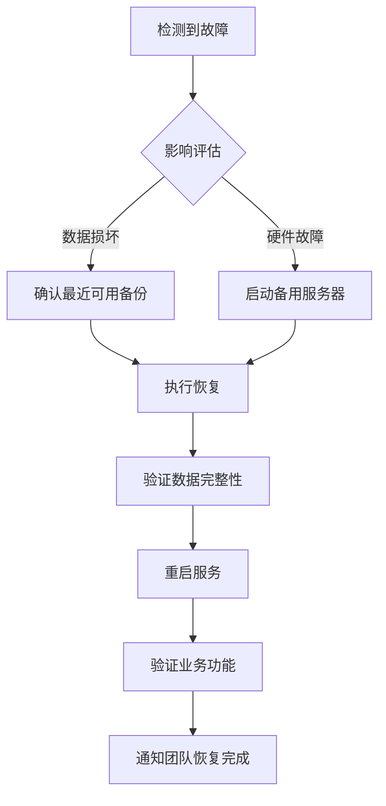

# M2-36 🗄️ 数据库备份与恢复策略

> **任务**：M2-36 数据库自动备份+季度恢复演练方案
> **版本**：v1.0 | **日期**：2026-06-14

---

## 1. 备份策略总览

| 项目 | 配置 |
|:----|:----|
| **备份类型** | 全量数据库导出 (mysqldump + gzip) |
| **执行频率** | 每天 02:30 (UTC+8) |
| **保留期限** | 30 天 |
| **存储位置** | 本地 `storage/app/backups/` |
| **远程存储** | S3 兼容对象存储（可选） |
| **文件备份** | 每周日 03:30 |
| **清理策略** | 保留最近 5 份，其余按保留天数清理 |

## 2. 恢复目标 (RTO / RPO)

| 指标 | 目标值 | 说明 |
|:---|:-----:|:----|
| **RTO** (恢复时间目标) | **< 5 分钟** | 从故障到服务完全恢复的时间 |
| **RPO** (恢复点目标) | **< 24 小时** | 最多丢失的数据时长 |
| **RTO 极端** | **< 30 分钟** | 跨区域灾备恢复 |

## 3. 备份架构

```
┌─────────────────┐     ┌──────────────────┐     ┌─────────────────┐
│  MySQL 8.0      │────>│  mysqldump        │────>│  gzip 压缩      │
│  生产数据库      │     │  --single-transaction│     │  (level 6)      │
└─────────────────┘     └──────────────────┘     └────────┬────────┘
                                                          │
                                                          ▼
                                           ┌─────────────────────────┐
                                           │  Local Storage          │
                                           │  storage/app/backups/    │
                                           │  保留 30 天              │
                                           └────────────┬────────────┘
                                                         │
                                                         ▼
                                           ┌─────────────────────────┐
                                           │  Remote Storage (S3)    │
                                           │  异地冗余备份            │
                                           └─────────────────────────┘
```

## 4. 备份分类

### 4.1 数据库备份 (每日)
- **命令**: `php artisan db:backup`
- **调度**: 每天 02:30 (`routes/console.php`)
- **内容**: 全库导出（排除 `backup_logs` 等临时表）
- **格式**: `db_backup_{database}_{YYYYMMDD_HHmmss}.sql.gz`

### 4.2 文件备份 (每周)
- **命令**: `php artisan files:backup`
- **调度**: 每周日 03:30
- **内容**: `storage/app/`, `storage/logs/`, `public/uploads/`
- **排除**: 日志文件、已有的备份文件、临时文件

### 4.3 清理策略 (每日)
- **命令**: `php artisan backup:cleanup`
- **调度**: 每天执行
- **规则**: 超过保留天数的备份自动删除，保留最近 N 份

## 5. 操作指南

### 5.1 手动备份
```bash
# 数据库备份
php artisan db:backup
php artisan db:backup --name="pre-upgrade-backup"

# 文件备份
php artisan files:backup

# 查看备份列表
php artisan backup:list
php artisan backup:list --type=files
```

### 5.2 从备份恢复
```bash
# 交互式恢复
php artisan db:restore

# 恢复到最近的备份
php artisan db:restore --latest

# 指定备份 ID 恢复
php artisan db:restore --backup=42

# 快速验证备份可用性
php artisan db:restore --dry-run
```

### 5.3 执行恢复演练
```bash
# 标准演练（验证最近 10 个备份）
php artisan recovery:drill

# 快速演练（验证最近 3 个备份）
php artisan recovery:drill --quick

# Staging 环境完整恢复测试
php artisan recovery:drill --staging
```

## 6. 恢复流程

### 6.1 标准恢复流程



### 6.2 详细步骤

```bash
# Step 1: 确认备份可用
php artisan backup:list
php artisan db:restore --dry-run --latest

# Step 2: 执行恢复（预计 1-5 分钟）
php artisan db:restore --latest --force

# Step 3: 清理缓存
php artisan cache:clear
php artisan config:clear

# Step 4: 验证数据
php artisan tinker --execute="echo \App\Models\License::count();"

# Step 5: 通知团队
php artisan notification:send --channel=slack --message="数据库已从备份恢复"
```

## 7. 季度恢复演练

### 7.1 演练计划

| 季度 | 时间 | 类型 | 负责人 |
|:---:|:----|:----|:-----:|
| Q1 | 3 月第 2 周 | 标准演练 | DevOps |
| Q2 | 6 月第 2 周 | 标准演练 | DevOps |
| Q3 | 9 月第 2 周 | 完整恢复测试 | DevOps + DBA |
| Q4 | 12 月第 2 周 | 完整恢复测试 | DevOps + DBA |

### 7.2 演练检查清单

- [ ] 备份记录完整性检查
- [ ] 备份文件可访问性检查
- [ ] 备份文件完整性校验 (gzip -t)
- [ ] RTO 评估 (< 5 分钟)
- [ ] RPO 评估 (< 24 小时)
- [ ] Staging 环境完整恢复（季度）
- [ ] 恢复后数据验证
- [ ] 演练报告存档

### 7.3 演练执行

```bash
# 自动化演练
php artisan recovery:drill --quick       # 季度快速检查
php artisan recovery:drill               # 标准检查
php artisan recovery:drill --staging     # 完整恢复测试
```

### 7.4 演练报告

演练结果自动保存到 `storage/app/backups/recovery-drill-report.json`。

报告内容：
- 演练时间戳
- 检查项及结果
- RTO/RPO 估算
- 整体状态 (PASSED/FAILED)

## 8. 监控与告警

| 指标 | 阈值 | 告警方式 |
|:----|:---:|:--------|
| 备份失败 | 连续 2 次失败 | Slack + 邮件 + 站内信 |
| 备份文件大小异常 | < 1MB（数据库备份） | Slack |
| 备份超时 | > 30 分钟 | Slack |
| 存储空间不足 | < 1GB | Slack + 邮件 |
| 恢复演练失败 | 任何检查项失败 | Slack + 邮件 |

## 9. 故障场景与应对

### 9.1 场景 A：数据误删除
```bash
# 1. 确认删除时间点
# 2. 找到删除前的备份
php artisan backup:list
# 3. 在 Staging 恢复 → 导出缺失数据 → 导入生产库
php artisan db:restore --backup=ID
```

### 9.2 场景 B：数据库损坏
```bash
# 1. 立即停止应用
php artisan down
# 2. 恢复到最近可用备份
php artisan db:restore --latest --force
# 3. 验证并恢复服务
php artisan up
```

### 9.3 场景 C：整个服务器故障
```bash
# 1. 启动备用服务器
# 2. 从 S3 拉取最近备份
aws s3 cp s3://backups/latest.sql.gz ./backup.sql.gz
# 3. 恢复数据库
gunzip -c backup.sql.gz | mysql -h new-host -u user -p dbname
# 4. 更新 DNS/CNAME
# 5. 验证恢复
```

## 10. 配置参考

### `.env` 备份相关配置
```ini
# 备份存储磁盘
BACKUP_DISK=local
BACKUP_REMOTE_DISK=s3

# 数据库备份
BACKUP_DATABASE_ENABLED=true
BACKUP_RETENTION_DAYS=30
BACKUP_DATABASE_SCHEDULE=0 2 * * *
BACKUP_COMPRESSION_LEVEL=6
BACKUP_EXCLUDE_TABLES=benchmark_logs,telescope_entries,telescope_monitoring

# 文件备份
BACKUP_FILES_ENABLED=true
BACKUP_FILE_RETENTION_DAYS=14

# 清理策略
BACKUP_AUTO_CLEANUP=true
BACKUP_KEEP_RECENT=5

# mysqldump 路径
MYSQLDUMP_PATH=mysqldump
```

## 11. 历史记录

| 日期 | 版本 | 变更内容 | 负责人 |
|:----|:---:|---------|:-----:|
| 2026-06-14 | v1.0 | 初始备份策略文档 | - |
