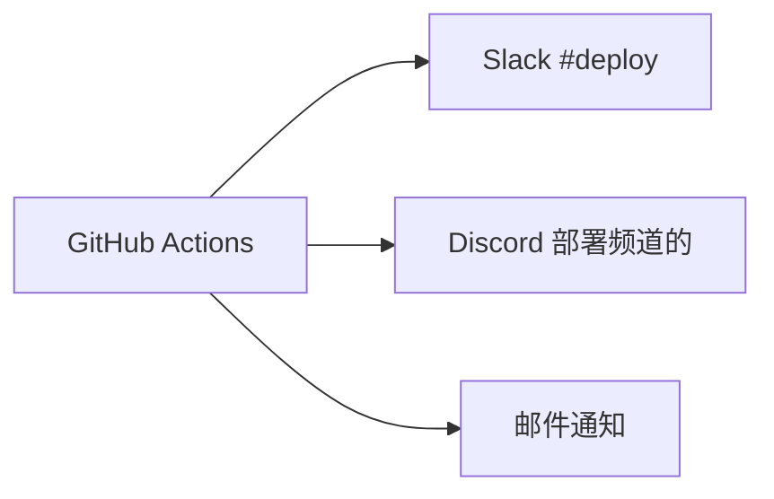

# 互物通 CI/CD 流水线配置

> **文档版本**: 1.0 | **更新日期**: 2026-06-15 | **对应任务**: M0-03

---

## 1. 流水线一览

| 工作流 | 文件 | 触发条件 | 执行时间 |
|:------|:----|:--------|:-------:|
| ✅ **CI** | `ci.yml` | push/PR → main/develop | ~8min |
| ✅ **代码质量** | `code-quality.yml` | 任意分支 push/PR | ~3min |
| ✅ **安全扫描** | `security-scan.yml` | push/PR → main + 每周日 + 手动 | ~15min |
| 🆕 **生产部署** | `deploy.yml` | Tag v* 推送 + 手动触发 | ~20min |
| 🆕 **Dependabot** | `dependabot.yml` | 每日自动检查依赖 | — |

---

## 2. 工作流详解

### 2.1 CI (`ci.yml`)

```
PHP 8.2/8.3 矩阵测试:
  ├── composer install
  ├── php artisan migrate --seed
  ├── vendor/bin/phpunit
  └── (SQLite + MySQL 双驱动)

前端构建:
  ├── npm ci
  ├── npx vitest run
  └── npm run build

代码质量门禁:
  ├── Pint 代码风格检查
  ├── PHPStan 静态分析 (level 6)
  └── 密钥硬编码扫描
```

### 2.2 代码质量 (`code-quality.yml`)

```
工具链:
  ├── Laravel Pint (PSR-12 代码风格)
  ├── PHPStan/Larastan (静态分析, level 6)
  └── Pre-commit Hook 配置

阻断规则:
  ├── Pint 检查失败 → 阻断
  ├── PHPStan Level 6 错误 → 阻断
  └── 含 TODO/FIXME/XXX 注释 → 警告
```

### 2.3 安全扫描 (`security-scan.yml`)

```
OWASP ZAP 自动化渗透测试:
  ├── 基线扫描 (每次 PR)
  ├── API 扫描 (基于 OpenAPI Schema)
  └── 完整扫描 (每周日 + 手动触发)

阻断规则:
  ├── High/Critical 漏洞 → 阻断发布
  ├── Medium 漏洞 → 警告 + 自动创建 Issue
  └── Low/Info → 记录日志
```

### 2.4 生产部署 (`deploy.yml`)

```
Build & Test:
  ├── composer install --no-dev
  ├── php artisan config:cache
  ├── npm ci && npm run build
  ├── Docker 构建: app + worker 镜像
  └── 推送至容器仓库

Staging 部署:
  ├── Helm upgrade staging
  ├── 等待 Pod 就绪
  └── 集成测试 (health check + smoke test)

Production Blue-Green:
  ├── 部署 Green 环境
  ├── 健康检查 (Green)
  ├── 流量切换至 Green
  ├── 观察期 (5分钟)
  └── 清理 Blue 环境
```

---

## 3. 环境与密钥配置

### 3.1 GitHub Secrets

| Secret | 用途 | 来源 |
|:-------|:----|:-----|
| `REGISTRY_URL` | 容器镜像仓库地址 | 阿里云 ACR / Docker Hub |
| `REGISTRY_USER` | 仓库登录用户名 | 容器服务 |
| `REGISTRY_PASS` | 仓库登录密码/Token | 容器服务 |
| `K8S_CONFIG_STAGING` | Staging K8s kubeconfig | K8s 集群 |
| `K8S_CONFIG_PRODUCTION` | Production K8s kubeconfig | K8s 集群 |
| `DISCORD_WEBHOOK` | 部署通知 Discord Webhook | Discord |
| `SLACK_WEBHOOK` | 部署通知 Slack Webhook | Slack |

### 3.2 环境变量 (Repository Variables)

| 变量 | 值 | 说明 |
|:----|:---|:-----|
| `PHP_VERSION` | `8.3` | 生产 PHP 版本 |
| `NODE_VERSION` | `20` | 前端构建 Node 版本 |
| `K8S_NAMESPACE` | `hwt-production` | 生产 K8s 命名空间 |

---

## 4. Docker 镜像构建

### 4.1 多阶段构建

```dockerfile
# Dockerfile (项目根目录)
FROM php:8.3-fpm-alpine AS base
# ... PHP 扩展安装、Composer 依赖、代码复制

FROM base AS vendor
# composer install --no-dev

FROM node:20-alpine AS frontend
# npm ci && npm run build

FROM base AS production
# 复制 vendor + public/build
# php artisan optimize
```

### 4.2 镜像列表

| 镜像名 | 基础镜像 | 大小 | 说明 |
|:-------|:---------|:---:|:-----|
| `hwt-license:latest` | `php:8.3-fpm-alpine` | ~180MB | App + Nginx |
| `hwt-license-worker:latest` | `php:8.3-cli-alpine` | ~150MB | Queue Worker |
| `hwt-license-reverb:latest` | `php:8.3-cli-alpine` | ~150MB | WebSocket |

---

## 5. 部署通知

每次部署自动推送通知至：



---

## 6. 回滚方案

| 场景 | 回滚方式 | 耗时 | 影响 |
|:----|:---------|:---:|:----|
| 应用代码问题 | Helm rollback 到上一版本 | < 2min | 零停机 |
| 数据库 Migration 问题 | 执行回滚 Migration 脚本 | < 5min | 短暂停服 |
| 配置问题 | 重新部署上一版本镜像 | < 3min | 零停机 |

---

## 7. 快速开始

```bash
# 1. Fork/Clone 仓库
git clone https://github.com/huwutong/hwt-license.git
cd hwt-license

# 2. 本地测试 CI 流程
composer install
npm ci
npm run build
vendor/bin/phpunit

# 3. 创建 Tag 触发生产部署
git tag v1.0.0
git push origin v1.0.0

# 4. 手动触发 Staging 部署
# → GitHub Actions → Deploy Production → Run workflow
```

---

> **维护者**: DevOps Team | **最后更新**: 2026-06-15
