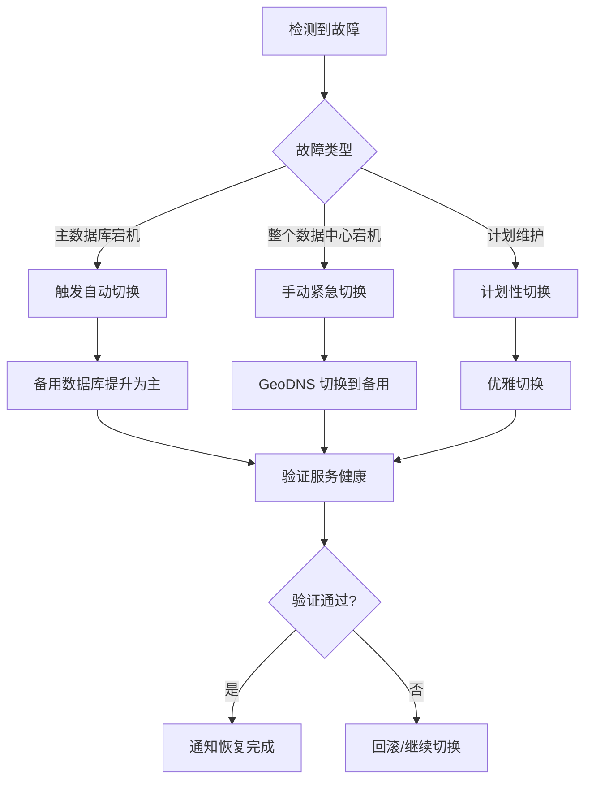

# M2-37 🗄️ 灾备切换方案

> **任务**：M2-37 灾备切换方案（主集群宕机→备用集群接管）
> **版本**：v1.0 | **日期**：2026-06-14

---

## 1. 恢复目标 (RTO / RPO)

| 指标 | 目标值 | 说明 |
|:---|:-----:|:----|
| **RTO** (恢复时间目标) | **< 5 分钟** | 从故障到备用集群接管服务的时间 |
| **RPO** (恢复点目标) | **< 1 分钟** | 最多丢失的数据时长 |
| **DNS 切换** | **< 1 分钟** | DNS TTL 配置 + 健康检查联动 |

## 2. 灾备架构

```
                     ┌─────────────────────┐
                     │   GeoDNS / 全局负载均衡 │
                     │   (AWS Route53/阿里云DNS) │
                     └──────┬──────────┬───┘
                            │          │
              ┌─────────────▼──┐  ┌────▼──────────────┐
              │  主数据中心       │  │  备用数据中心       │
              │  (Primary DC)   │  │  (Standby/DR DC)  │
              │  ap-southeast-1  │  │  ap-northeast-1   │
              ├─────────────────┤  ├──────────────────┤
              │  • Web 服务器    │  │  • Web 服务器      │
              │  • App 服务器    │  │  • App 服务器      │
              │  • MySQL 主库    │  │  • MySQL 从库      │
              │  • Redis 主      │  │  • Redis 从        │
              │  • 队列 Worker   │  │  • 队列 Worker     │
              └─────────────────┘  └──────────────────┘
                        │                   │
                        └────────┬──────────┘
                                 │
                      ┌──────────▼──────────┐
                      │   共享存储 / 备份      │
                      │   S3 跨区域复制       │
                      │   数据库异步复制       │
                      └─────────────────────┘
```

### 2.1 主数据中心 (Primary)

| 组件 | 配置 | 可用性 |
|:----|:----|:-----:|
| Web 服务器 | Nginx + PHP-FPM, 多副本 | 99.99% |
| 应用服务器 | Laravel, 水平扩展 | 99.99% |
| 数据库 | MySQL 8.0 主从 | 99.99% |
| 缓存 | Redis 7.0 Sentinel | 99.99% |
| 队列 | Laravel Horizon | 99.99% |
| 对象存储 | S3 / OSS | 99.99% |

### 2.2 备用数据中心 (Standby/DR)

- 与主数据中心物理隔离（不同区域）
- 保持热备状态：应用已部署，数据库保持同步
- 日常承担读流量（读写分离）保持 warm 状态
- 主中心故障时 5 分钟内接管全部流量

## 3. 故障切换类型

### 3.1 计划性切换 (Planned)
- 原因：维护、升级、迁移
- 流程：备份 → 通知 → 切换 → 验证 → 通知

### 3.2 自动故障切换 (Auto-Failover)
- 触发条件：健康检查连续 N 次失败、延时超过阈值
- 自动执行预配置的故障切换规则
- 切换后通知运维团队

### 3.3 手动紧急切换 (Manual)
- 触发条件：突发故障、数据损坏、安全事件
- 通过命令或管理后台手动执行

## 4. 故障切换流程



### 4.1 紧急故障切换步骤

```bash
# Step 1: 确认故障
php artisan dr:failover --list                    # 查看可用规则
php artisan dr:failover --rule=1 --dry-run        # Dry-run 验证

# Step 2: 执行故障切换
php artisan dr:failover --rule=1 --reason="主数据中心宕机" --force

# Step 3: 验证备用数据中心健康
php artisan multi-region:health-check             # 执行健康检查

# Step 4: 通知团队
# (通过 Slack/企微/钉钉自动通知)

# Step 5: 故障恢复后回切
php artisan dr:failover --rule=1 --restore --reason="故障已修复" --force
```

### 4.2 计划性切换步骤

```bash
# Step 1: 提前备份
php artisan db:backup --name="pre-dr-switch"

# Step 2: 通知相关方（提前 24h）
# Step 3: 执行切换前健康检查
php artisan multi-region:health-check --all

# Step 4: 执行切换
php artisan dr:failover --rule=1

# Step 5: 验证
curl https://api.huwutong.com/health/ready

# Step 6: 切换完成通知
```

### 4.3 恢复回切步骤

```bash
# Step 1: 确认主数据中心已恢复
# Step 2: 确保数据一致性
# Step 3: 执行回切
php artisan dr:failover --rule=1 --restore

# Step 4: 验证主数据中心健康
curl https://api.huwutong.com/health/ready

# Step 5: 记录切换日志
```

## 5. 自动故障切换

### 5.1 健康检查配置

| 参数 | 默认值 | 说明 |
|:----|:-----:|:----|
| 检查间隔 | 30s | 每个数据中心的健康探测间隔 |
| 超时 | 10s | HTTP 探测超时时间 |
| 失败阈值 | 3 | 连续失败 N 次触发切换 |
| 恢复阈值 | 3 | 连续成功 N 次恢复服务 |
| 延迟阈值 | 1000ms | 超过此延迟标记为降级 |

### 5.2 自动切换条件

以下条件同时满足触发自动切换：
1. 健康检查连续失败 ≥ 3 次
2. 备用数据中心健康状态正常
3. 规则配置了 `auto_failover = true`
4. 不在静默维护窗口内

## 6. 灾备演练

### 6.1 演练计划

| 季度 | 时间 | 类型 | 负责人 |
|:---:|:----|:----|:-----:|
| Q1 | 3 月第 3 周 | 桌面推演 | DevOps |
| Q2 | 6 月第 3 周 | 半自动切换 | DevOps + DBA |
| Q3 | 9 月第 3 周 | 完整切换 | DevOps + DBA |
| Q4 | 12 月第 3 周 | 完整切换 + 回切 | 全团队 |

### 6.2 演练场景

| 场景 | 模拟方式 | 预期 RTO |
|:----|:--------|:-------:|
| 数据库主库宕机 | 停止 MySQL 主库 | < 1min |
| Web 服务器不可用 | 停止 Nginx | < 30s |
| 整个区域宕机 | 网络隔离 | < 5min |
| Redis 缓存故障 | 停止 Redis | < 1min |
| 队列 Worker 耗尽 | 停止 Horizon | < 2min |

### 6.3 演练执行

```bash
# 半自动切换演练
php artisan dr:failover --rule=1 --dry-run       # 验证仅
php artisan dr:failover --rule=1 --reason="演练"  # 执行切换
# ...验证...
php artisan dr:failover --rule=1 --restore --reason="演练恢复"  # 回切

# 混沌工程演练
php artisan chaos:run --experiment=db_failover
php artisan chaos:run --experiment=redis_outage
```

## 7. 故障场景与应对

### 7.1 场景 A：主数据库宕机

```bash
# 自动触发 → 备用提升为主
# 手动确认
php artisan dr:failover --rule=1

# 应用自动切换到新主库
# 验证读写正常
curl https://api.huwutong.com/health/ready
```

### 7.2 场景 B：整个区域故障

```bash
# 1. 执行紧急故障切换
php artisan dr:failover --rule=1 --reason="区域故障" --force

# 2. 更新 DNS/GeoDNS
# (自动或手动更新 DNS 记录)

# 3. 验证备用集群
php artisan multi-region:health-check --all

# 4. 通知用户/客户
php artisan notification:send --channel=status --message="故障切换完成"
```

### 7.3 场景 C：数据损坏

```bash
# 1. 立即停止服务
php artisan down

# 2. 从最近的可用备份恢复
php artisan db:restore --latest --force

# 3. 验证数据完整性
php artisan tinker --execute="echo \App\Models\License::count();"

# 4. 恢复服务
php artisan up

# 5. 如果本地恢复失败 → 启动灾备切换
php artisan dr:failover --rule=1 --force
```

### 7.4 场景 D：网络分区

```bash
# 1. 健康检查检测到主中心不可达
# 2. 自动切换规则激活（如果配置了自动切换）
# 3. 备用数据中心接管
# 4. 网络恢复后手动评估数据一致性
php artisan dr:failover --rule=1 --restore  # 手动回切
```

## 8. 监控与告警

| 指标 | 阈值 | 告警方式 | 响应时间 |
|:----|:---:|:--------|:-------:|
| 数据中心健康 | 连续 2 次失败 | Slack + 邮件 + 电话 | < 1min |
| 数据库复制延迟 | > 30s | Slack + 邮件 | < 2min |
| API 可用率 | < 99.9% | Slack + 邮件 | < 2min |
| DNS 探测失败 | 1 次失败 | Slack | < 1min |
| 证书到期 | < 7 天 | Slack + 邮件 | < 1 天 |

## 9. 配置参考

### 故障切换规则配置 (`config/multi-region.php`)
```php
// 健康检查
'health_check' => [
    'interval_seconds' => 30,
    'timeout_seconds' => 10,
    'failure_threshold' => 3,
    'recovery_threshold' => 3,
    'latency_threshold_ms' => 1000,
],

// DNS 切换
'dns' => [
    'provider' => env('DNS_PROVIDER', 'route53'),
    'ttl' => 60,
    'record_prefix' => 'api',
    'zone_id' => env('DNS_ZONE_ID'),
],
```

### 预设数据中心
系统预配置 6 个数据中心（东京/新加坡/法兰克福/弗吉尼亚/俄勒冈/悉尼），
可通过管理后台 → 多区域管理 或 `php artisan multi-region:seed` 初始化。

## 10. 故障切换命令参考

| 命令 | 说明 |
|:----|:----|
| `php artisan dr:failover --list` | 列出所有切换规则 |
| `php artisan dr:failover --rule=1` | 执行故障切换 |
| `php artisan dr:failover --rule=1 --restore` | 执行恢复回切 |
| `php artisan dr:failover --rule=1 --dry-run` | 验证不执行 |
| `php artisan dr:failover --rule=1 --force` | 跳过确认 |
| `php artisan multi-region:health-check` | 健康检查 |
| `php artisan chaos:run --experiment=db_failover` | 混沌工程模拟 |

## 11. 历史记录

| 日期 | 版本 | 变更内容 | 负责人 |
|:----|:---:|---------|:-----:|
| 2026-06-14 | v1.0 | 初始灾备方案文档 | - |
