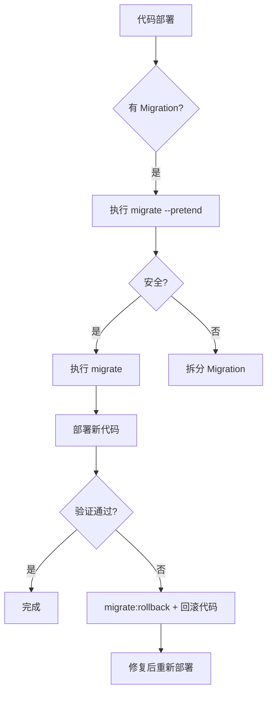

# 零停机数据库 Migration 策略

> **对应任务**: M1.1-18 | **优先级**: P0 | **日期**: 2026-06-15

## 核心原则

1. **向前兼容**：新 Migration 必须兼容旧版代码，支持蓝绿部署回滚
2. **增量变更**：大表变更分批进行，避免长时间锁表
3. **可逆性**：每个 Migration 必须提供 `down()` 回滚方法
4. **自动化验证**：CI 自动执行 `migrate --pretend` + 回滚测试

## MySQL 8.0 Online DDL 策略

MySQL 8.0 支持 Online DDL（`ALGORITHM=INPLACE, LOCK=NONE`），以下操作可零停机执行：

| 操作 | Online 支持 | 说明 |
|------|:----------:|------|
| `ADD COLUMN` | ✅ (INPLACE) | 非 `AFTER` 位置可瞬间完成 |
| `DROP COLUMN` | ✅ (INPLACE) | 行格式重写较慢，大表建议低峰期 |
| `ADD INDEX` | ✅ (INPLACE) | 仅读锁，不阻塞 DML |
| `DROP INDEX` | ✅ (INPLACE) | 仅读锁 |
| `RENAME COLUMN` | ✅ (INPLACE) | MySQL 8.0+ 支持 |
| `MODIFY COLUMN` | ⚠️ (需评估) | 仅类型兼容变更可在线 |
| `ADD FOREIGN KEY` | ✅ (INPLACE) | 需持有 SHARED 锁 |

## 回滚测试流程（CI 自动执行）

```yaml
# .github/workflows/migration-test.yml
migration-test:
  steps:
    - run: php artisan migrate:fresh  # 正向执行全部迁移
    - run: php artisan migrate:rollback --step=1  # 逐条回滚
    - run: php artisan migrate:fresh  # 再次正向执行（验证可重复性）
```

## Laravel Migration 最佳实践

### 1. 大表操作

```php
// ✅ 正确：非阻塞 ADD COLUMN
Schema::table('large_table', function (Blueprint $table) {
    $table->string('new_col', 50)->nullable();
});

// ❌ 错误：带 AFTER 会触发表重建
$table->string('new_col', 50)->after('existing_col'); // 避免
```

### 2. 批量数据处理

```php
// ✅ 正确：分批处理
public function up(): void
{
    Schema::table('licenses', function (Blueprint $table) {
        $table->string('new_field')->nullable();
    });

    // 数据回填分批进行（使用 Artisan command 而非 migration）
    // 参见: php artisan license:backfill-new-field
}
```

### 3. 索引创建时机

```php
// ✅ 先插数据再建索引（大表）
Schema::create('table', function (Blueprint $table) {
    $table->id();
    // ... 列定义，不建索引
});
// 数据导入完成后单独建索引
Schema::table('table', function (Blueprint $table) {
    $table->index('col');
});
```

## 部署流程



## 回滚脚本

```bash
# 回滚最后一批迁移
php artisan migrate:rollback

# 回滚到指定版本
php artisan migrate:rollback --batch=3

# 回滚特定迁移（生产慎用）
php artisan migrate:rollback --path=database/migrations/xxx.php
```

## 验证命令

```bash
# 预览 SQL（不执行）
php artisan migrate --pretend

# 检查迁移状态
php artisan migrate:status

# 检查是否有待处理迁移
php artisan migrate:check
```
